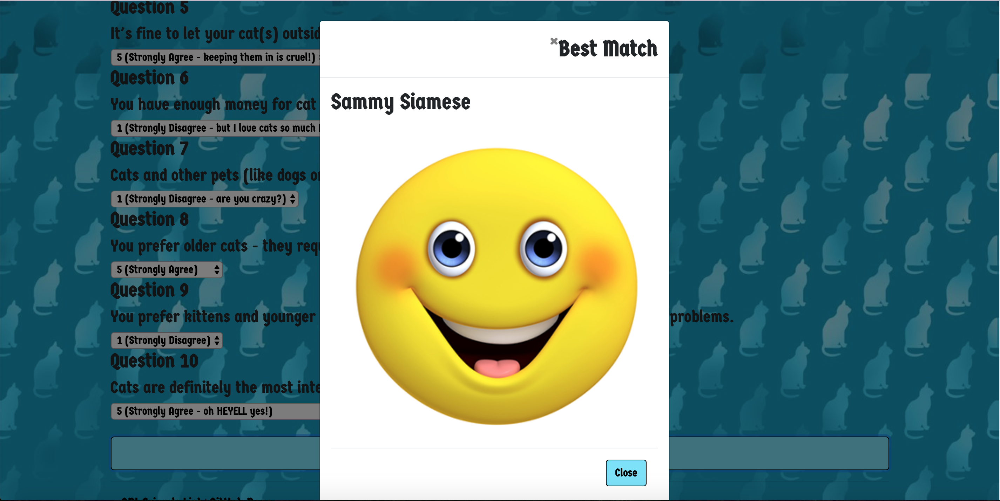

# friend-finder

## Overview

Friend-finder is a compatibility-based friend-finding application for cat lovers. This full-stack site takes in results from users' surveys, then compares their answers with those from other users. The app then displays the name and picture of the cat lover with the best overall match.

## Built with

Express, Node.js

## Instructions

To find your perfect cat-obsessed friend, visit this app's [homepage](https://cat-person-friend-finder.herokuapp.com/).

Click *Begin Survey*.

Fill out the blank form. Include data for all fields, otherwise you won't be able to submit.

Click *Submit Answers*.

Your results will be displayed in a modal.

